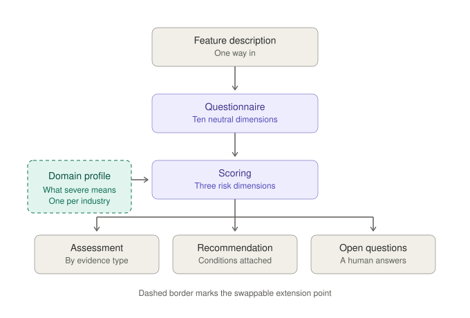

# Feature Risk Triage

A reference framework for assessing the risk of a proposed machine learning feature before it ships.

You describe a feature. It produces an assessment, a recommendation, and a list of what a human still has to decide. It does not approve anything, and it is not a compliance certification.

The restaurant scenario throughout is illustrative. It exists to show the framework doing something non-obvious, not to describe any real company or product.



---

## The problem it exists for

Most risk questionnaires produce the same report for every feature. Boxes get ticked, a severity gets picked from a dropdown, and the output satisfies a process without telling anyone anything they did not already know.

Two habits cause that.

**Severity gets asserted rather than derived.** Someone picks "High" because the feature feels important, and nothing connects that word to what actually happens when the feature is wrong. Once a rating is in a document it tends to stay there, and the reasoning behind it is rarely written down anywhere it can be checked later.

**The assessment inherits whatever the submitter claimed.** If someone answers "no, this does not touch sensitive data," that answer flows straight through to the conclusion, with no distinction between what was stated, what was inferred, and what nobody actually looked into.

This framework separates those three, and it makes severity something a team has to write down in advance rather than choose in the moment.

---

## Worked example

The scenario below is invented. Any resemblance to a real product is coincidental.

An example restaurant platform wants a diner-facing chatbot. Scan a QR code at the table, ask questions in free text, get answers from the restaurant's ingredient records. "Does the carbonara have nuts?" Servers get asked constantly and it slows down table turns.

It sounds benign. That is why it is the example.

The questionnaire surfaces the shape. Ingredient data in, no diner PII, but question text leaves the boundary to a third-party model. The model is generative rather than a constrained lookup. No human reviews anything, because it is real time at the table. It produces text and takes no action, which reads reassuring right up until the audience question, where the exposed party turns out to be the diner while the paying customer is the operator. Those are not the same person.

Then the three dimensions that decide it. The worst realistic failure is a diner with a severe allergy being told a dish is safe when it is not. Detectability is close to zero, because nobody logs "the bot said it was fine" and you learn about it from an incident. Reversibility is zero once the food is eaten.

The risk driver turns out not to be the model. It is menu data staleness. The kitchen runs out of pine nuts on a Saturday night, substitutes walnuts, and that substitution never reaches the record the bot reads. The model can be perfectly accurate against data that is wrong.

**Recommendation: do not ship as designed.** The condition is not better prompting. It is a change to the answer contract, so the bot can never affirm safety. It can confirm that a dish contains an allergen. For anything else it declines and routes to a server. That converts an unbounded generative risk into a bounded one, and it survives stale data, because the failure mode becomes an unnecessary handoff instead of a hospitalization.

**Open questions handed back to a human.** Who owns menu accuracy contractually. Whether the substitution workflow writes back to the ingredient record. What the operator agreement says about liability. Whether the diner is told they are talking to a model. None of those are answerable by a tool, and all of them have to be answered before anyone ships.

Run the same framework against a prep-quantity forecaster at the same company and it comes back low risk, ship it. Historical sales in, no PII, a manager approves every order, it recommends rather than orders, and a bad forecast shows up in inventory within a day and gets fixed on the next one.

Two features, one company, one framework, opposite answers. Something that flags everything is indistinguishable from something that flags nothing.

---

## Where this applies

The questionnaire does not change between these. The profile and the answers do.

**Resume screening assistant.** Ranks applicants against a role. Internal audience, no customer exposure, and it only produces a ranking rather than a decision, which makes it look low risk. The dimensions that bite are detectability and reversibility: a model that systematically downranks a group produces output that looks entirely reasonable one candidate at a time, and the people affected never learn they were affected. Severity is legal and ethical rather than physical, and detection requires auditing in aggregate, which nobody does by default. Likely recommendation: ship with mandatory sampled review and retained decision logs.

**Support reply drafting.** Suggests a response, an agent edits and sends. Customer-facing text, third-party model, real customer data in the prompt. But a human reviews every output before it leaves, the agent is accountable for what they send, and a bad draft costs seconds. Human in the loop collapses most of the risk on its own. Likely recommendation: ship, with disclosure to agents that drafts are model-generated so they review rather than rubber-stamp.

**Automated invoice coding.** Assigns general ledger codes to incoming invoices without review. This one takes action rather than producing text, which is the dimension most teams underweight. Severity is moderate and financial, but reversibility is good and detectability is decent, since miscoded entries surface at reconciliation. The risk is concentrated in volume: one wrong code is nothing, ten thousand wrong codes is a restatement. Likely recommendation: ship with a confidence threshold that routes low-confidence items to a human, plus a monthly audit sample.

Notice what varies. The support tool is saved by human review. The invoice tool is saved by reversibility. The screening tool has neither, which is why it is the one that needs conditions despite looking the most harmless.

---

## Design decisions

**Bands, not scores.** Severity, likelihood, and detectability resolve to bands rather than a number out of 100. A composite score implies a precision the inputs do not support, and it invites the worst behavior in this category, which is tuning inputs until the number clears a threshold. The cost is real: bands are harder to trend over time and harder to put on a dashboard. That tradeoff is deliberate.

**It can say do not ship.** Always with conditions attached. Something that can only ever say "proceed with caution" is decoration, and something that says no without a path forward gets removed within a quarter. The allergen case is the shape: a clear no, plus a specific change that turns it into a yes.

**Unknown is a state, not a severity.** The obvious move is to treat anything unknown as high risk. That is safer on paper and wrong in practice, because it collapses "we checked and it is bad" into "nobody looked," and those need different responses. Every finding is tagged **stated**, **derived**, or **unknown**. The cost is that a team can proceed with unknowns outstanding, so unknowns surface in the recommendation as blocking or non-blocking rather than disappearing into a rating.

**Severity anchors are written in advance, by the team, in the profile.** Not chosen during the assessment. A profile has to state what each harm archetype means for that business before any feature is run through it. This is the part most questionnaires skip, and skipping it is why their severity ratings mean nothing.

**Two extension points, not three.** The domain profile is swappable and the severity anchor source is swappable. Intake is not. Feature descriptions go in as YAML, one way in, no plugin layer for web forms and ticket systems. Every additional seam is a promise to maintain something nobody has asked for yet.

---

## How it is put together

The risk questions are domain-neutral. What makes a risk severe is not.

"Does a human review this before a customer sees it" is the same question at a restaurant platform, a bank, and a hospital. But "the model was wrong" means a rounding error in one and a hospitalization in another. So the core carries the questionnaire and the scoring, and a domain profile supplies the rest:

- which data classes count as sensitive
- - which obligations attach to them
  - - the harm archetypes, and what each severity band means for this business
    - - who "the customer" actually is, which is a more common source of error than it sounds
     
      - The restaurant profile ships as the reference. A profile for another industry is a YAML file and an afternoon of a team arguing about what severe means to them. That argument is the point; the file is just where it gets recorded.
     
      - ### On severity anchors
     
      - Anchors are judgment, deliberately. A team encodes what "severe" means in their business, in advance, where it can be reviewed and disagreed with later.
     
      - Organizations with real incident history should anchor on it, and the profile interface is the place to plug that in. This repo does not ship anyone's incident data and does not depend on any external dataset, so it clones and runs with nothing configured.
     
      - ---

      ## What is in the repo

      ```
      core/          questionnaire, scoring, orchestration, the two interfaces
      profiles/      restaurant reference profile
      examples/      allergen chatbot (high risk) and prep forecaster (low risk)
      tests/
      ```

      ---

      ## What this is not

      Not a compliance certification, not a legal review, not a substitute for counsel. Not a gate, and it has no authority to approve anything. It produces an argument that a person then has to agree or disagree with, and the audit record exists so that person can reconstruct the reasoning later.

      If it ever starts functioning as a rubber stamp, it has failed at the thing it was built for.

      ---

      ## Status

      Early. This is the design and the reference profile. The scoring bands have not been tested against real features.

      One thing shifted during design. I expected severity to dominate the recommendation. Working through the allergen case on paper, detectability turned out to be doing more of the work. Maximum severity with good detectability is a manageable feature. Maximum severity with no detectability is the one that ends up in a news story. That interaction is currently emergent from the scoring and probably deserves to be explicit in it. Whether it holds once real features run through it is an open question.

      MIT licensed.
      
